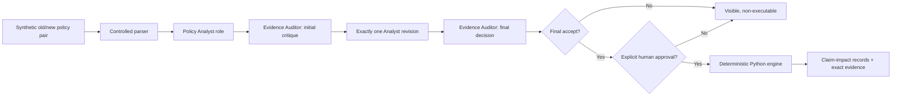

# PolicyImpact

**PolicyImpact: An Evidence-Grounded Agentic AI Copilot for Policy
Change-to-Claim Review**

PolicyImpact is a synthetic proof of concept for Cotiviti internship assessment
Topic 3, **Content Management in Health Care**. It demonstrates a narrow,
auditable handoff from an old/new policy comparison to human-approved candidate
rules and deterministic claim-impact review.

> **Synthetic demonstration only.** Every policy, code, rule, and claim is
> invented. The repository contains no PHI, real payer policy, real code-system
> content, payer contract, or patient/provider record. PolicyImpact does not
> approve or deny claims, determine medical necessity, identify fraud, calculate
> payment, or make a clinical decision.

## Problem statement

A policy change can lose its evidentiary context as it moves from prose to a
structured rule and then to claim review. PolicyImpact keeps that chain visible:

- exact old/new policy sections;
- typed proposed changes and rule fields;
- an isolated Evidence Auditor critique;
- exactly one bounded Analyst revision;
- a final Auditor decision and separate human approval;
- deterministic claim matching with exact evidence traceability.

The project tests workflow safety and reproducibility on one controlled scenario.
It does not claim production readiness, real-world accuracy, savings, or
generalization.

## Scope

The controlled scenario contains policy `SYN-PAY-042` versions 1.0 and 2.0,
four expected material changes, three executable old/new rule pairs, one expected
abstention, and 16 synthetic claims. The claims include six clearly affected,
six clearly unaffected, two boundary, and two ambiguity-review fixtures.

The parser intentionally supports one numbered Markdown grammar. The rule engine
supports only the invented fields and fixed operators required by this scenario.
Neither is a universal healthcare policy parser or adjudication engine.

Both policy versions are intentionally applied to the **same** claims to isolate
policy-change impact. Service dates are validated and displayed but do not choose
the governing version in this proof of concept.

## Architecture



The final Auditor decision alone never authorizes execution. Every executable
pair must also receive an explicit human approval. Rejected and abstained changes
remain visible and non-executable. In the reviewed execution path, only the three
accepted and human-approved executable pairs are supplied to the engine. The
unchanged fictional procedure scope and the ambiguity marker are carried as
controlled context; the latter can only route a record to abstention and human
review, never execute the undefined clause.

## Two role-isolated agents

The provider layer supports two modes:

- **Reviewed offline fixture** — default, versioned, deterministic, network-free,
  and clearly labeled as a replay rather than a live response.
- **Optional live role calls** — uses the same configured model under separate
  Analyst and Auditor system roles with isolated inputs and typed Pydantic output.

The roles are not presented as independent model vendors. They store only the
proposal, candidate rule, evidence, concise critique, revision, and final
decision. The application neither requests nor exposes hidden chain of thought.

The interaction is fixed:

```text
Analyst proposal
→ Auditor critique
→ one Analyst revision or reasoned retention
→ Auditor final decision
→ explicit human approval
```

There is no open-ended debate and no second AI revision loop.

## Responsibility boundary

| Function | AI role | Deterministic code | Human |
|---|:---:|:---:|:---:|
| Compare policy wording and propose material changes | Yes | Controlled input preparation | Reviews evidence |
| Propose typed old/new rule pairs | Yes | Pydantic validation | Approves or rejects |
| Challenge evidence, qualifications, and overinterpretation | Auditor | Typed validation | Reviews final decision |
| Authorize a rule for execution | No | Enforces both gates | **Yes** |
| Match fields, compare units, and assign impact outcomes | No | **Yes** | Interprets review signal |
| Make payment, coverage, medical-necessity, clinical, or fraud decisions | **No** | **No** | Outside project scope |

## Data provenance

All runtime inputs are checked into `data/` and were authored specifically for
this demonstration:

- `data/policies/` — two invented policy versions;
- `data/claims/` — 16 normalized synthetic claims using only `SYN-` codes;
- `data/ground_truth/ground_truth.json` — manual expected changes, rule pairs,
  abstention, claim outcomes, and evidence sections;
- `data/ground_truth/demo_human_approvals.json` — explicit reviewed-demo
  approvals for the three accepted pairs;
- `data/agent_fixtures/offline_agent_review.json` — versioned reviewed Analyst
  and Auditor replay.

The public research used for the report is listed separately in
[`report/SOURCE_NOTES.md`](report/SOURCE_NOTES.md). No proprietary Cotiviti
assessment instruction is included in this repository.

## Install

Python 3.11 or newer is required.

```bash
python3 -m venv .venv
source .venv/bin/activate
python -m pip install -e ".[dev]"
python -m pytest -W error
```

For optional live role calls, install the extra provider dependency locally:

```bash
python -m pip install -e ".[dev,live]"
cp .env.example .env
```

Then set `OPENAI_API_KEY` and, optionally, `POLICYIMPACT_MODEL` in your local
environment. The `.env.example` file is a template; the application does not
silently load it. If you create a local `.env`, export it into the current shell
before launch, for example:

```bash
set -a
source .env
set +a
```

The default live model is `gpt-5.6-terra`; it can be overridden explicitly.
Never commit `.env` or a credential. Live mode is optional and was not invoked
for the reported evaluation.

## Run

### Streamlit demonstrator

```bash
streamlit run streamlit_app.py --server.headless true
```

Use the four tabs in order:

1. **Overview** — scope, architecture, and limitations;
2. **Policy & Agent Discussion** — replay the roles, inspect exact evidence, and
   explicitly approve or reject accepted rules;
3. **Claim Impact** — available only after all three accepted pairs pass both
   gates; inspect one claim and export CSV/JSON;
4. **Evaluation** — separate offline-agent and deterministic results.

The precise recording path is in
[`video/DEMO_RUNBOOK.md`](video/DEMO_RUNBOOK.md).

### Command-line demonstrator

Run the complete reviewed fixture and approved deterministic path:

```bash
policyimpact --project-root .
```

Verify that missing human approvals block execution:

```bash
policyimpact --project-root . --without-demo-approvals
```

The top-level entry point follows the same reviewed fixture, final Auditor, and
explicit reviewed-demo human-approval path:

```bash
python app.py
```

There is no public application entry point that bypasses the Auditor and human
execution gates.

## Controlled evaluation

The checked-in reviewed fixture was evaluated against the manual ground truth:

| Metric | Controlled result |
|---|---:|
| Policy-change precision | 4/4 |
| Policy-change recall | 4/4 |
| Executable rule-field exact match | 6/6 |
| Evidence-section accuracy | 8/8 |
| Abstention correctness | 1/1 |
| Unsupported final assertions | 0 |
| Deterministic claim-impact accuracy | 16/16 |
| Evidence traceability | 20/20 |

These are scenario-consistency results from a reviewed offline demonstration
fixture. Perfect replay scores are expected because the fixture is aligned to
the controlled ground truth. They are not live-model accuracy, production
performance, or a savings estimate. See
[`evaluation/EVALUATION_REPORT.md`](evaluation/EVALUATION_REPORT.md) and
[`evaluation/evaluation_results.json`](evaluation/evaluation_results.json).

## Deliverables

- Word report: [`report/Jiuyi_Zheng_PolicyImpact_Report.docx`](report/Jiuyi_Zheng_PolicyImpact_Report.docx)
- Report PDF: [`report/Jiuyi_Zheng_PolicyImpact_Report.pdf`](report/Jiuyi_Zheng_PolicyImpact_Report.pdf)
- PowerPoint: [`slides/Jiuyi_Zheng_PolicyImpact_Presentation.pptx`](slides/Jiuyi_Zheng_PolicyImpact_Presentation.pptx)
- Presentation PDF: [`slides/Jiuyi_Zheng_PolicyImpact_Presentation.pdf`](slides/Jiuyi_Zheng_PolicyImpact_Presentation.pdf)
- Timed script: [`video/VIDEO_SCRIPT.md`](video/VIDEO_SCRIPT.md)
- Recording runbook: [`video/DEMO_RUNBOOK.md`](video/DEMO_RUNBOOK.md)

The candidate-recorded MP4 and a current public-safe resume are not included.
If added later, both should be reviewed for private or confidential information
before they are committed to a public repository.

## Limitations

- One controlled policy pair and a manually designed 16-claim scenario.
- Controlled Markdown parser, invented fields, and a small fixed operator set.
- Reviewed offline role fixture; no live model was empirically evaluated.
- Manual ground truth is scenario-authored, not independently adjudicated.
- Documentation content is not ingested; missing modifiers route to review.
- The engine emits one primary review signal per claim using a fixed controlled
  priority. It is not an exhaustive analysis of every concurrent policy effect.
- No FHIR ingestion, vector database, model fine-tuning, deployment, or
  production security/compliance assessment.
- No estimate of external validity, clinical validity, payment accuracy,
  productivity, or savings.

A defensible next step is a result-blind, multi-policy pilot with independent
domain experts, preregistered criteria, disagreement reporting, prospective live
runs, and explicit stop/rollback gates.

## AI and software-tool disclosure

Generative AI tools assisted with code and evidence auditing, literature
organization, and drafting/editing of project materials. The candidate reviewed
the resulting code, citations, claims, and text and is responsible for the final
submission. AI tools are not represented as authors, domain experts, or
autonomous researchers.

The report contains its own concise disclosure. The offline fixture is clearly
labeled wherever its outputs appear.

## Repository structure

```text
app.py                         Complete gated demonstration entry point
streamlit_app.py               Four-tab demonstration interface
src/policyimpact/              Typed models, roles, gates, engine, exports, CLI
data/policies/                 Synthetic old/new policy documents
data/claims/                   Sixteen synthetic claims
data/ground_truth/             Manual gold data and demo approvals
data/agent_fixtures/           Reviewed offline role replay
evaluation/                    Machine-readable results and interpretation
tests/                         Unit, integration, workflow, export, and UI tests
report/                        Word/PDF report and source audit
slides/                        PowerPoint/PDF deck with speaker notes
video/                         Script, runbook, and privacy checklist
resume/                        Reserved for a reviewed public-safe resume
scripts/                       Reproducible fixture and document builders
```
